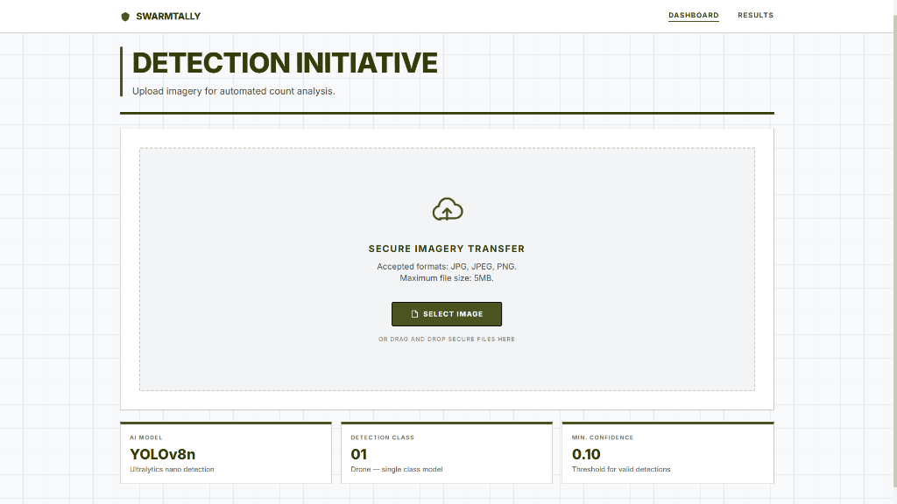
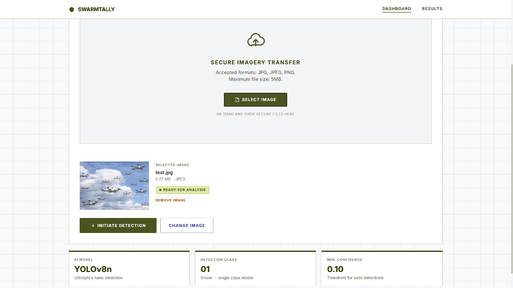

# Swarmtally – AI Drone Detection & Counting System

<div align="center">


[](https://github.com/YOUR_USERNAME/Drone_detection/actions/workflows/ci.yml)
[](LICENSE)
[](https://python.org)
[](https://nextjs.org)
[](https://fastapi.tiangolo.com)
[](https://ultralytics.com)

**AI-powered web application that detects and counts drones in uploaded images using a trained YOLOv8 model.**

[Live Demo](#deployment) · [API Docs](#api-reference) · [Docker Setup](#docker-one-command-startup) · [Deployment](#deployment)

</div>

---

## Overview

Swarmtally is a full-stack AI application that runs YOLOv8 drone detection inference on user-uploaded images. Upload a photo, and the system returns an annotated image with bounding boxes, a drone count, and per-detection confidence scores — all in under 200ms on a GPU.

**Design theme:** "Duty and Honor" — a military-inspired tactical interface using olive, saffron, and navy.

### User Interface

#### 1. Dashboard (Main Upload Portal)
The default dashboard features a clean, military-tactical grid layout displaying the active AI model version, detection class, confidence threshold, and a drag-and-drop secure imagery transfer drop zone.



#### 2. Image Checker & Pre-Verification
Once an image is selected, the visual image checker loads it instantly, displaying details like filename, file size, format, and status. This allows the operator to verify they have selected the correct image before submitting it to the YOLOv8 model for automated detection.



### Key Features

- 🎯 **Real-time drone detection** using a custom-trained YOLOv8n model
- 📊 **Per-drone confidence scores** with visual progress bars
- 🖼️ **Annotated output images** with saffron bounding boxes (DRN-01, DRN-02...)
- ⚡ **Fast inference** — typically 50–200ms depending on hardware
- 🐳 **Docker-ready** — one command to run the full stack
- 🚀 **Deployment-ready** — Vercel (frontend) + Render (backend)
- 📱 **Responsive** — works on desktop and mobile

---

## Tech Stack

| Layer | Technology | Version |
|---|---|---|
| Frontend | Next.js (App Router) + TypeScript | 14 |
| Styling | Tailwind CSS | 3.4 |
| Backend | FastAPI + Uvicorn | 0.111+ |
| AI Model | Ultralytics YOLOv8n | 8.2+ |
| Image Processing | OpenCV (headless) | 4.8+ |
| Containerization | Docker + Docker Compose | – |
| Frontend Deploy | Vercel | – |
| Backend Deploy | Render | – |

---

## Project Structure

```
Drone_detection/
├── .github/
│   └── workflows/
│       └── ci.yml              ← GitHub Actions CI pipeline
│
├── backend/
│   ├── main.py                 ← FastAPI app + YOLOv8 inference (core logic)
│   ├── config.py               ← Centralized constants and settings
│   ├── logging_config.py       ← Structured logging setup
│   ├── best.pt                 ← Trained YOLOv8 model weights
│   ├── requirements.txt        ← Python dependencies
│   ├── Dockerfile              ← Backend container definition
│   ├── render.yaml             ← Render deployment config
│   ├── Procfile                ← Process file for Render/Heroku
│   ├── runtime.txt             ← Python version for Render
│   ├── .env.example            ← Environment variable template
│   ├── uploads/                ← Auto-created: temp upload storage
│   └── outputs/                ← Auto-created: annotated result images
│
├── frontend/
│   ├── src/
│   │   ├── app/
│   │   │   ├── page.tsx             ← Upload / Dashboard page
│   │   │   ├── results/page.tsx     ← Detection results page
│   │   │   ├── layout.tsx           ← Root layout + SEO metadata
│   │   │   ├── globals.css          ← Global styles + design tokens
│   │   │   └── api/detect/route.ts  ← Next.js API proxy to backend
│   │   ├── components/
│   │   │   ├── Navbar.tsx           ← Desktop navigation
│   │   │   ├── MobileNav.tsx        ← Mobile bottom navigation
│   │   │   ├── UploadZone.tsx       ← Drag-and-drop file upload
│   │   │   └── SkeletonLoader.tsx   ← Loading skeleton UI
│   │   ├── lib/
│   │   │   └── api.ts               ← Type-safe API service layer
│   │   └── types/
│   │       └── detection.ts         ← Shared TypeScript types
│   ├── Dockerfile              ← Frontend container definition
│   ├── vercel.json             ← Vercel deployment config
│   ├── next.config.js          ← Next.js configuration
│   ├── tailwind.config.js      ← Tailwind + design system
│   ├── tsconfig.json           ← TypeScript configuration
│   ├── .eslintrc.json          ← ESLint rules
│   ├── .prettierrc             ← Prettier formatting config
│   ├── package.json            ← Node.js dependencies + scripts
│   └── .env.example            ← Frontend env variable template
│
├── dataset/                    ← Training dataset (not used at runtime)
├── training_Results/           ← YOLOv8 training run artifacts
├── docker-compose.yml          ← Full-stack Docker orchestration
├── .env.example                ← Root env template (for Docker)
├── Makefile                    ← Developer shortcuts
├── .gitignore                  ← Git ignore rules
├── .dockerignore               ← Docker build context exclusions
├── LICENSE                     ← MIT License
├── CONTRIBUTING.md             ← Contribution guide
└── README.md                   ← This file
```

---

## Detection Workflow

```
User Uploads Image
        ↓
Next.js Frontend (port 3000)
  – File validation (type, size)
  – Drag-and-drop or click upload
        ↓ POST /api/detect (Next.js proxy)
FastAPI Backend (port 8000)
  – File extension validation
  – OpenCV image decode
        ↓
YOLOv8 Inference (best.pt)
  conf_threshold = 0.25
        ↓
count = len(results[0].boxes)
        ↓
Draw saffron bounding boxes (OpenCV)
  Labels: "DRN-01: 91.2%", "DRN-02: 88.9%"...
        ↓
Save annotated image → /outputs/
        ↓
Return JSON { drone_count, confidences, processed_image_url, inference_ms }
        ↓
Frontend results page
  – Annotated image with tactical HUD overlay
  – Drone count (large number, padded to 2 digits)
  – Threat level badge (Area Clear / Single / Multiple / Swarm)
  – Per-drone confidence bars
  – Session metadata (inference time, model version)
```

---

## Quick Start – Local Development

### Prerequisites

| Tool | Version |
|---|---|
| Python | 3.10+ |
| Node.js | 18+ |
| npm | 9+ |

### 1. Clone the Repository

```bash
git clone https://github.com/YOUR_USERNAME/Drone_detection.git
cd Drone_detection
```

### 2. Backend Setup

```bash
cd backend

# Create and activate virtual environment
python -m venv venv

# Windows
venv\Scripts\activate
# macOS / Linux
source venv/bin/activate

# Install dependencies
pip install -r requirements.txt

# Copy environment variables
cp .env.example .env

# Start the FastAPI server
uvicorn main:app --reload --host 0.0.0.0 --port 8000
```

> **Note:** Make sure `best.pt` is in the `backend/` folder before starting.

Backend will be available at: **http://localhost:8000**

- API documentation: http://localhost:8000/docs
- Health check: http://localhost:8000/health

### 3. Frontend Setup

```bash
cd frontend

# Install Node.js dependencies
npm install

# Copy environment variables
cp .env.example .env.local
# Edit .env.local if your backend runs on a different port

# Start the Next.js dev server
npm run dev
```

Frontend will be available at: **http://localhost:3000**

---

## Docker – One Command Startup

Run the complete stack with a single command:

```bash
# 1. Copy the root environment file
cp .env.example .env

# 2. Build and start both containers
docker-compose up --build
```

| Service | URL |
|---|---|
| Frontend | http://localhost:3000 |
| Backend API | http://localhost:8000 |
| API Docs | http://localhost:8000/docs |

**Stop the stack:**
```bash
docker-compose down
```

**Using Make shortcuts:**
```bash
make docker-up    # Build and start
make docker-down  # Stop and remove
make docker-logs  # Stream logs
```

> **Docker note:** Uploaded images and annotated results are persisted in named Docker volumes (`swarmtally-uploads`, `swarmtally-outputs`). They survive container restarts.

---

## Deployment

### Frontend → Vercel

1. Push your repository to GitHub
2. Go to [vercel.com](https://vercel.com) → **Add New Project** → Import your repo
3. Set **Root Directory** to `frontend`
4. Add environment variables in Vercel dashboard:

   | Variable | Value |
   |---|---|
   | `API_URL` | `https://your-backend.onrender.com` |
   | `NEXT_PUBLIC_API_URL` | `https://your-backend.onrender.com` |

5. Click **Deploy** — Vercel reads `vercel.json` automatically

### Backend → Render

1. Push your repository to GitHub
2. Go to [render.com](https://render.com) → **New Web Service** → Connect your repo
3. Set **Root Directory** to `backend`
4. Render will auto-detect `render.yaml` and configure the service
5. Add environment variable in Render dashboard:

   | Variable | Value |
   |---|---|
   | `FRONTEND_URL` | `https://your-app.vercel.app` |

6. Click **Deploy**

> **Important:** The `best.pt` model file must be committed to your repository (it's ~6MB). The CI pipeline skips model loading — only local/Docker/Render runs load it.

---

## API Reference

### `POST /detect`

Accepts a drone image and returns detection results.

**Request:** `multipart/form-data`

| Field | Type | Required | Description |
|---|---|---|---|
| `file` | `image/jpeg` or `image/png` | ✅ | Drone image to analyze |

**Success Response (200):**

```json
{
  "drone_count": 5,
  "confidences": [0.9124, 0.8891, 0.8732, 0.7651, 0.6943],
  "processed_image_url": "/outputs/result_abc12345.jpg",
  "inference_ms": 148.3
}
```

**Error Responses:**

| Status | Description |
|---|---|
| `400` | Invalid file type, empty file, or corrupt image |
| `500` | Internal server error during inference |

### `GET /health`

Returns API health status.

```json
{
  "status": "ok",
  "app": "Swarmtally",
  "model": "best.pt",
  "version": "1.0.0"
}
```

### `GET /outputs/{filename}`

Serves annotated result images as static files.

---

## Environment Variables

### Backend (`backend/.env`)

| Variable | Default | Description |
|---|---|---|
| `FRONTEND_URL` | `http://localhost:3000` | Frontend URL for CORS allow-list |
| `PORT` | `8000` | Server port (set automatically by Render) |
| `LOG_LEVEL` | `INFO` | Logging verbosity: `DEBUG`, `INFO`, `WARNING`, `ERROR` |

### Frontend (`frontend/.env.local`)

| Variable | Default | Description |
|---|---|---|
| `API_URL` | `http://localhost:8000` | Backend URL for the Next.js server-side proxy |
| `NEXT_PUBLIC_API_URL` | `http://localhost:8000` | Backend URL exposed to the browser (for image loading) |

---

## Development Scripts

### Backend
```bash
# Start with hot reload
uvicorn main:app --reload --port 8000

# Run with custom log level
LOG_LEVEL=DEBUG uvicorn main:app --reload --port 8000
```

### Frontend
```bash
npm run dev           # Start development server
npm run build         # Build production bundle
npm run start         # Start production server
npm run lint          # Run ESLint
npm run lint:fix      # Auto-fix ESLint issues
npm run format        # Auto-format with Prettier
npm run format:check  # Check formatting without writing
npm run type-check    # TypeScript type checking
```

### Make (Project Root)
```bash
make install      # Install all dependencies
make dev-backend  # Start backend server
make dev-frontend # Start frontend server
make docker-up    # Start with Docker Compose
make docker-down  # Stop Docker containers
make lint         # Lint frontend
make format       # Format frontend
make type-check   # TypeScript check
make clean        # Remove build artifacts
make help         # Show all commands
```

---

## Design System

Swarmtally uses the **"Duty and Honor"** design palette — a military tactical aesthetic.

| Token | Hex | Usage |
|---|---|---|
| Olive (Primary) | `#4b5320` | Buttons, accents, navigation |
| Saffron (Secondary) | `#fe9832` | Bounding boxes, threat badges |
| Navy (Tertiary) | `#222894` | Secondary CTAs |
| Dark Olive | `#343c0a` | Headlines, primary text |
| Surface | `#f8f9fa` | Page background |
| Grid Line | `#e1e3e4` | Blueprint grid pattern |
| Font | Inter | All typography |

---

## Model Information

| Property | Value |
|---|---|
| Architecture | YOLOv8n (nano) |
| Framework | Ultralytics 8.2+ |
| Classes | 1 (drone) |
| Confidence threshold | 0.25 |
| Input | Any resolution JPEG/PNG |
| Output | Bounding boxes + confidence scores |
| File | `backend/best.pt` (~6MB) |

### Training

The model was trained on a custom drone dataset located in `dataset/`. Training artifacts (curves, confusion matrix, validation results) are in `training_Results/`.

To retrain:
```bash
# Install ultralytics
pip install ultralytics

# Train (customize paths and epochs)
yolo detect train model=yolov8n.pt data=dataset/data.yaml epochs=100 imgsz=640
```

---

## Troubleshooting

| Issue | Solution |
|---|---|
| `Model file not found` | Ensure `best.pt` is in `backend/` folder |
| `Could not connect to detection service` | Start backend: `uvicorn main:app --reload --port 8000` |
| Image loads but shows error | Check `NEXT_PUBLIC_API_URL` in `.env.local` matches backend port |
| CORS error | Check `FRONTEND_URL` env var on backend; ensure backend is running |
| Docker build fails (OpenCV) | The Dockerfile installs `libgl1` and `libglib2.0-0` — these are required |
| Render deployment timeout | Model loading takes ~30–60s cold start — health check allows 60s start period |
| `next.config.js` standalone error | If not using Docker, remove `output: 'standalone'` from `next.config.js` |

---

## Contributing

See [CONTRIBUTING.md](CONTRIBUTING.md) for the full contribution guide.

Quick summary:
1. Fork the repository
2. Create a branch: `git checkout -b feat/your-feature`
3. Make changes and verify everything works
4. Run `npm run lint` and `npm run type-check`
5. Open a pull request with a clear description

---

## License

MIT – See [LICENSE](LICENSE) for details.

Built for educational and research purposes.

---

<div align="center">
<sub>Made with ⚡ using FastAPI + Next.js + YOLOv8</sub>
</div>
